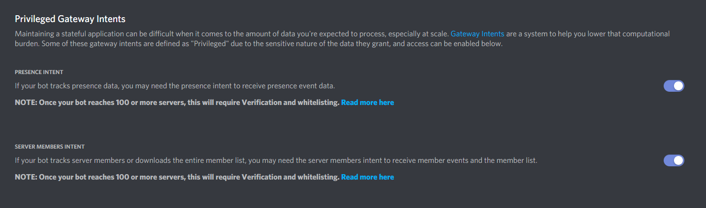

# Bluezelle Discord Bot

## Usage

Type `$help` to see a list of commands.

## Development

To use this discord bot, you must have a bot set up through the discord developers portal.

Then simply install the requirements and run `py -3 bot/main.py --secret_token <your_token>`

### More specifically:

`py -3 -m venv venv`

Linux/MacOS: `source venv/bin/activate`, Windows: `.\venv\Scripts\Activate.ps1`

`pip install -r requirements.txt`

`py -3 configs/write_config.py`

Enter your secret token into 'configs/config.ini'

`py -3 bot/main.py`

If you run into a Privileged Intents Error, the bot must have the following options enabled:

